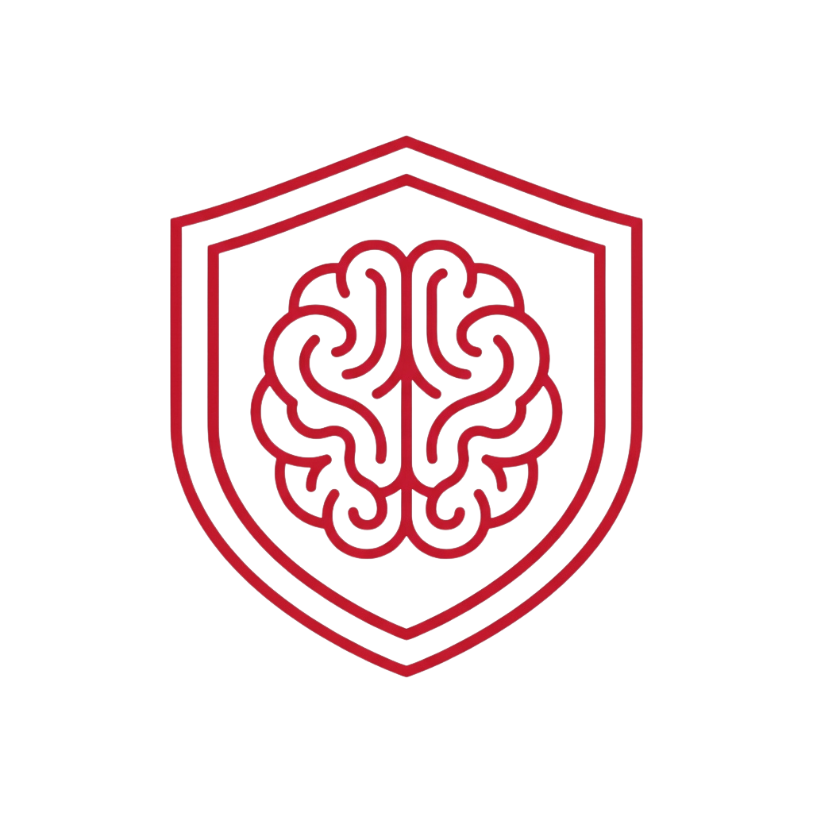
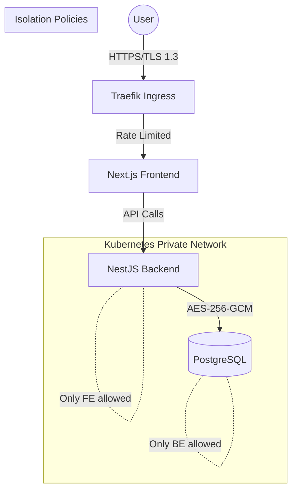

<div align="center">
  
  <h1>VaultedMind</h1>
  <p>Ultra-Secure Mental Health Vault</p>
</div>

VaultedMind is a high-security, full-stack application designed to track mental health, daily journals, and personal reflections with absolute privacy and military-grade encryption.

[]()
[](https://nestjs.com/)
[](https://nextjs.org/)
[]()
[](https://kubernetes.io/)

---

Website : https://vault-mind.cyrus-ag.com/

## Architecture & Security

VaultedMind is built on a Zero Trust Architecture. Your data is never stored in plain text.



### Key Security Features
- **At-Rest Encryption**: Every log and custom field is encrypted using AES-256-GCM before hitting the database.
- **Blind Indexing**: User emails are hashed and indexed separately to allow secure lookups without exposing raw PII.
- **Network Isolation**: Kubernetes NetworkPolicies ensure that only the backend can talk to the database, and only the frontend can talk to the backend.
- **Brute-Force Protection**: Strict rate-limiting on authentication endpoints.
- **Hardened Headers**: HSTS, CSP, and X-Frame-Options enforced at the Ingress level.

---

## Project Structure

```bash
vault-projet/
├── vault-back/           # NestJS Backend (Domain-Driven Design)
├── vault-front/           # Next.js Frontend (Premium UI/UX)
├── k8s/                   # Kubernetes Manifests (ArgoCD & Kustomize)
├── docker-compose.yml     # Local Development Orchestration
└── .github/workflows/     # Automated CI/CD Pipelines
```

---

## Quick Start

### 1. Prerequisites
- Docker & Docker Compose
- Node.js 24+ & Yarn 4.6+

### 2. Local Setup
```bash
# Clone the repository
git clone https://github.com/VictorAgahi/VaultedMind.git
cd VaultedMind

# Setup environment (Placeholder keys provided)
cp vault-back/.env.example vault-back/.env.local
cp vault-front/.env.example vault-front/.env.local

# Launch with Docker Compose
docker compose up --build
```

Access the app at http://localhost:3000.

---

## Testing Strategy
- **Unit Tests**: Full coverage for business logic and encryption services.
- **E2E Tests**: Automated flows for registration, login, and data synchronization.
- **Security Audit**: Scanned for secrets and vulnerabilities in CI/CD.

---

## Tech Stack
| Component | Technology |
| :--- | :--- |
| **Frontend** | Next.js 15, MUI v6, TypeScript |
| **Backend** | NestJS, TypeORM, PostgreSQL |
| **DevOps** | Docker, K3s, ArgoCD, Traefik |

---

## Contributing
Contributions are welcome! Please read our CONTRIBUTING.md (coming soon) for details on our code of conduct and the process for submitting pull requests.

## License
This project is licensed under the MIT License - see the [LICENSE](LICENSE) file for details.

---
**VaultedMind** - Your mind is your sanctuary. We just provide the vault.
